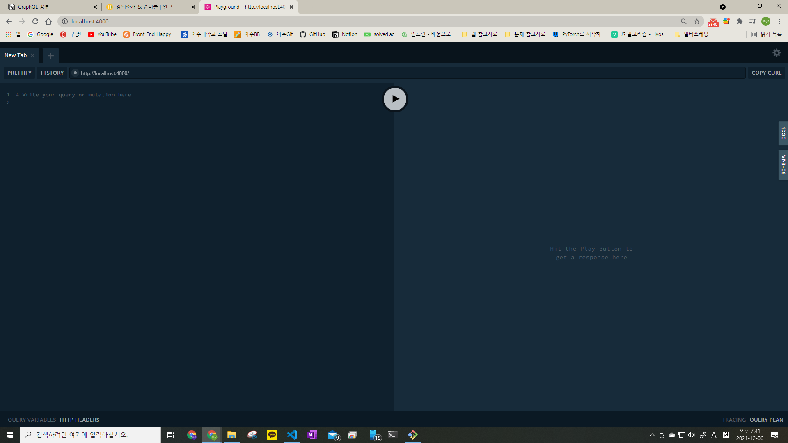

## GraphQL 사용해보기

2021/12/04

- nodemon이란?
  - 서버 코드를 변경할 때마다 자동으로 서버를 재시작 해주는 역할을 한다.

```bash
$npm install -g nodemon

$nodemon --watch src/ src/index.js

```

- src/디렉토리에서 코드 변화가 감지되면 재시작하도록 설정하고, src/index.js를 실행하도록 한다.

  - nodemon을 실행시키면 기본적으로 4000번 포트에서 서버가 실행된다.
    

- 서버에서 명령어를 입력하여 데이터를 불러올 수 있다.

  - query : RESTful API에서의 GET과 비슷한 역할

```js
query{
    team(id:2){
	  id
	  manager
	  mascot
	  member{
		first_name
		last_name
	  }
    }
}
```

- 위의 쿼리는 team에서 id가 2인 team의 id, manaber, mascot, member{first_name, last_name}을 불러오는 쿼리이다.
- 명령어를 입력하여 데이터를 수정, 삭제를 할 수 있다.
  - mutation

### GraphQL의 강점

- 필요한 정보들만 선택하여 받아올 수 있음
  - Overfetching 문제 해결
  - 데이터 전송량 감소
- 여러 계층의 정보들을 한 번에 받아올 수 있음
  - Underfetching 문제 해결
  - 요청 횟수 감소
  - 아래는 teams의 id,mascot, manager와 roles의 id, requirement를 함꼐 불러오는 쿼리

```js
query{
  teams{
      id
      mascot
      manager
    }
  roles {
      id
      requirement
    }
}
```

- 하나의 endpoint에서 모든 요청을 처리.
  - 하나의 URI에서 POST로 모든 요청 처리 가능
  - 명령어를 통해 어떤 정보를 요청하는지 처리 가능

### Apollo는 왜 쓰는가?

- GraphQL은 '명세', 형식일 뿐이다.
- GraphQL 형식으로 요청을 보내고 받을 수 있는 서비스가 필요.
- 즉, GraphQL을 구현할 솔루션이 필요하다.
  - 백엔드에서 정보를 제공 및 처리
  - 프론트엔드에서 요청 전송
  - GraphQL.js, GraphQL Yoga, AWS Amplify, Relay 등
  - JS 뿐만 아니라 다른 언어, 다른 툴이 많이 존재한다.
- **Apollo GraphQL**
  - 백엔드와 프론트엔드 모두 제공 (Apollo Server, Apollo Client(React 활용 가능))
  - 간편하고 쉬운 설정
  - 풍성한 기능 제공
